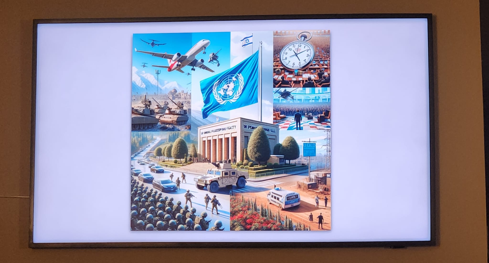

**Frame A(I)rt**
=======================

Control the Art Mode of a Samsung TV using the TV's API by uwing your own images based on whatever prompt you want.

In this case, it renders an image of the top news of the day.




**Description**
---------------

The script uses the Samsung TV's API to retrieve the list of available art, select the latest art based on the highest content_id, and upload new images to the TV.

**Requirements**
---------------

* Python 3.x
* Samsung Frame TV with Art Mode enabled
* Network connection to the TV

**Usage**
-----

1. Install the required libraries by running `pip install samsungtvws`
2. Create a new file called `config.py` with the following contents:
```python
from news import get_prompt
TV_IP = '192.168.1.100'  # Replace with your TV's IP address
# Set your OpenAI API key.
OPENAI_API_KEY = # Your OpenAI API key
PPX = # Your perplexity APU key

# Modify the prompt to your liking
PROMPT = f"Generate an photrealistic image consolidating the various items in {get_prompt('Enter your prompt here')}"

```
3. Run the script by executing `python main.py`

**Functions**
-------------

* `upload_image(image_name: str) -> None`: Uploads a new image to the TV
* `delete_art(content_id: str) -> None`: Deletes the image from the TV
* `get_content_id() -> Optional[str]`: Gets the current art info

**Files**
------

* `main.py`: The main script
* `config.py`: Configuration file with TV IP address

**Notes**
-----

* Make sure to replace the `TV_IP` variable in `config.py` with your TV's actual IP address.
* TV's Art Mode needs to be enabled and configured correctly.

